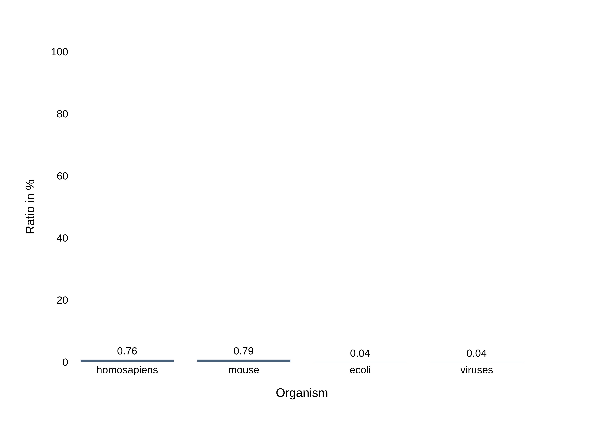
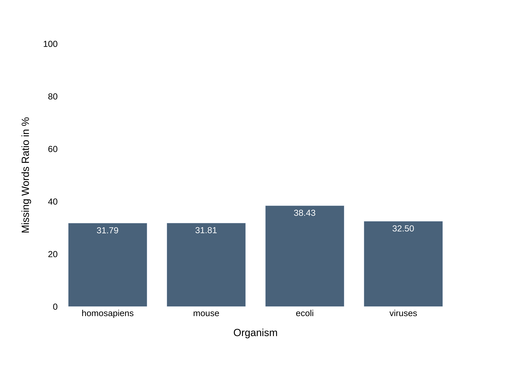

# What is (not) a peptide: A computational approach towards understanding the language of life.

This README file provides instructions on how to clone the code repository for the protein language project. It includes steps to set up the development environment and any dependencies required to run the project.

The code in this repository is build using elixir 1.18 and python 3.10 (plotting). 

## Run analysis pipelines
Clone the code `git clone https://github.com/abidikhairi/protein-language && cd protein-language`.

### Run wordcount: frequency

```bash
  mix wordcount <path/to/input/sequences.csv> <demiliter> <seq-index> <kmer-length> <path/to/output.csv> frequency
```

```bash
  mix wordcount data/uniprot-sequences/homosapiens.csv , 1 2 data/output/homosapiens/coverage/k2.csv frequency
```

### Run wordcount: coverage
```bash
  mix wordcount <path/to/input/sequences.csv> <demiliter> <seq-index> <kmer-length> <path/to/output.csv> coverage
```
```bash
  mix wordcount data/uniprot-sequences/homosapiens.csv , 1 2 data/output/homosapiens/coverage/k2.csv coverage
```

### Run mutation analysis
```bash
  mix mutation <path/to/mutation.csv> <kmer-length> <path/to/output.csv>
```
#### Example
```bash
  mix mutation data/human_mutagen.csv 2 data/output/homosapiens/mutation/k2.csv
```

Example input:
```text
Entry,Sequence,Original,Position,Mutation
A0A0C5B5G6,MRWQEMGYIFYPRKLR,E,5,A
A0A0C5B5G6,MRWQEMGYIFYPRKLR,G,7,A
A0A0U1RRE5,MGDQPCASGRSTLPPGNAREAKPPKKRCLLAPRWDYPEGTPNGGSTTLPSAPPPASAGLKSHPPPPEK,K,22,A
A0A0U1RRE5,MGDQPCASGRSTLPPGNAREAKPPKKRCLLAPRWDYPEGTPNGGSTTLPSAPPPASAGLKSHPPPPEK,P,23,A
A0A0U1RRE5,MGDQPCASGRSTLPPGNAREAKPPKKRCLLAPRWDYPEGTPNGGSTTLPSAPPPASAGLKSHPPPPEK,P,24,A
```

## Analysis Results:

Analyized species: `[homosapiens, ecoli, mouse, viruses]`.

### Word frequency results
<div align="center">
  
  
  
  
  
</div>

### Rare words distribution

<div align="center">
  
  
  
  
  
</div>

### Missing words distributon
<div align="center">
  
  
  
  
  
</div>


### Mutation analysis on homosapiens

Number of analyzed protein sequences is 5039 sequences, spanning 31195 mutations.

We found that, when a mutation occurs it will change to a more frequent word.

- $k = 2$: 66.06% of cases when the mutation coverage is higher than the word coverage.
- $k = 3$: 62.54%
- $k = 3$: 57.56%
